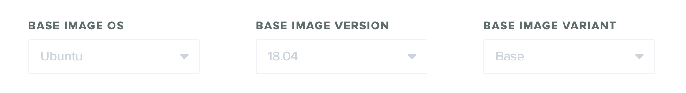

# Base Images

The default base image that we use is currently Ubuntu 22.04.
The previous default version was Ubuntu 18.04.

You'll see this default auto-selected on the Configure Autograder page.
Gradescope supports selecting a different base image to build your
autograder with.

When you create a new autograder, it will default to the current
default base image. If you do not want to change the default base image,
you can upload your autograder Zip file and select "Update Autograder"
on the Configure Autograder page of your Gradescope assignment. Over
time, new base image versions may be released
and become the default version. We recommend that you update your
autograders to use the latest versions when available to take
advantage of the latest software updates and security features.

Rebuilding an autograder or duplicating an autograder will use the
same base image as was previously selected.

## Base Image Options

### Base Image OS

This is the operating system which the base image is running
(e.g. Ubuntu, Fedora, etc).

### Base Image Version

This is the major version of the OS which is loaded in the base image
(E.g. 18.04 for Ubuntu). Note that minor software upgrades may happen
from time to time without changing the major version of the OS
(i.e. individual packages may receive minor updates while keeping the
same version of the OS). This is up to the upstream OS maintainers'
software upgrade policies.

### Base Image Variant

Variants may add to or modify the pre-installed software in the base
image. This can be used to improve autograder build times by avoiding
installing packages in the setup phase.

Selecting *Base* will mean that it is a fresh install of the OS with
no modifications to the default installed programs, other than what
our autograder platform requires.

Additional base images may be added which contain commonly installed
packages, such as different versions of Python or Java. This should
decrease the build time for those autograders.
