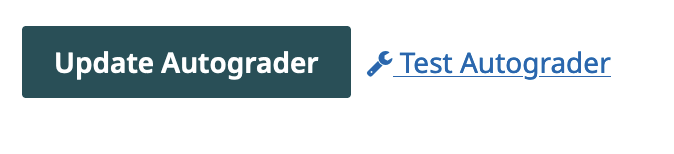
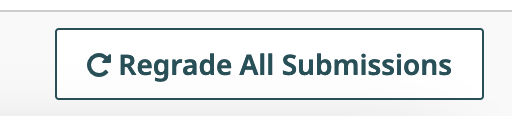

# Code Autograder Best Practices

Here are some suggestions from our team, as well as from our community of Gradescope users who have built code autograders, around how to build autograders that are secure and robust. If this is your first time building a code autograder, please ensure you first review our [Autograder Specifications](../specs/) and example autograders. 

Note that depending on the nature of your programming assignment and the programming language you are using, not all of these best practices may apply.

## General Best Practices

### Implement timeouts

Include timeouts for individual test executions to limit the maximum time each individual test case can take. This prevents tests from hanging indefinitely to ensure you always return useful results to your students.

### Handle all exceptions raised in tests

Capture and handle all exceptions that are raised during test execution. Proper exception handling prevents your autograder from failing to produce results for your students.

### Capture compiler errors and present to students

Capture and present compiler errors to students in a clear and informative way. This allows students to address syntax or compilation issues and encourages a better understanding of their mistakes.

### Ensure that a `results.json` file is written out in some way even if the autograder fails

Regardless of whether the autograder fails, make sure that a results.json file is generated. This can provide information about the grading progress, aiding in troubleshooting and analysis even in cases of failure. A strategy would be to output partial results.json files as each test is run, so that some results will be always given to students even if your autograder crashes.

### Test your autograder prior to releasing the assignment

It is important to test your autograder within Gradescope, as your autograder may behave differently when running locally vs. on our autograder platform.
When you first set up your programming assignment on Gradescope, set the Release Date to be in the future so that students don’t immediately see the assignment. Once you’ve uploaded your code autograder file, test it via the Test Autograder button on the assignment’s Configure Autograder page with a sample submission that passes all the test cases and a sample submission that fails certain cases, to ensure each test is working as intended. Use the [Debug via SSH](../ssh/) option to troubleshoot any issues. You can then update the Release Date/Time for the assignment from the Assignment Settings page.




## Security Best Practices

### Run your autograder as a non-root user

To enhance security, the autograder should be executed as a non-root user. The autograder will begin running your code as `root`, so that you (the instructor) can have full privileges to do what you need to do. However, we recommend that you run the students’ code with minimal privileges to reduce the risk of potential unauthorized access or changes to the current submission’s score. 

To add non-root users, you can add a user with the Ubuntu [base image](../base_images/), such as `adduser student --no-create-home --disabled-password --gecos ""` (Note: This command will differ based on the base image you select.) We recommend adding users in your autograder setup files, although this can be done anywhere and at any time prior to running the student code with that user.

When you add the student user, you should use `chmod o= <file>` to remove access to the source and results directories, so the student code is unable to access those directories. Make sure to give read/write permissions to files in the source folder, which the executing student code needs. Then you should be able to execute the student code by first changing your user, such as with `runuser -u student -- COMMAND`, before you execute the student code. Here’s some example code to see this working with Ubuntu 22.04 (note that other base images may have different commands to add users and run as a user):

```bash
$ # Creates a user with name student with no password
$ adduser student --no-create-home --disabled-password --gecos ""
$ # Remove other read/write access to the source folder
$ chmod o= source
$ # Command to see the current user you are logged in with.
$ whoami
root
$ # List the files in the source folder
$ ls source
FILES IN SOURCE
$ # Execute the command `whoami` as the `student` user
$ runuser -u student -- whoami
student
$ # Execute the command list the source folder as the `student` user. Note that the chmod above removed permissions for the student to access that folder.
$ runuser -u student -- ls source
ls: cannot open directory 'source': Permission denied
$ # Checking who I am to show that we are still the root user
$ whoami
root
```

### Isolate Student Code Execution

Execute student code within a separate subprocess from the autograder code. This isolation prevents direct interaction between the student's code and the autograder's code, ensuring that the student's code doesn't interfere with the autograder's functionality. For example, if you are using Python, you should not import a student's code directly in your autograder. Instead, we recommend that you create a small, untrusted, wrapper around the student code which may run it in some way. Then you should have your autograder read the results and then perform its normal action. This will prevent the student from interrupting your autograder.

An untrusted wrapper is a separate file or program which can be executed to run the students’ code with as simple of tests as possible. The wrapper could take in some arguments which would change what the wrapper tries to run with the student code, or it could just be a simple function which runs the student code and prints the result of that execution to your autograder. Your autograder should then be the one deciding what to do with that result without exposing the autograder permissions to the students’ code. We recommend that your autograder validates that the students’ code did what it is supposed to do, rather than having the wrapper parse the results and return a passed/failed message. The latter approach would allow a student to take over execution of the wrapper and just give the passed signal back regardless of whether it is correct.

### Restrict imports and functions

Depending on the programming language, you may be able to restrict certain imports or functions that grant file system or network access. This helps maintain the security of the system by preventing students from using capabilities which can view autograder code or change the results which are returned to Gradescope. Some languages allow you to check for usage of some imports while others allow you to override the way in which code and files are imported or loaded. You can utilize those methods to check whether or not the students’ code is using libraries or functions that may access the file system or the internet.


### Restrict OS-Level Features

Consider restricting specific OS-level features or system calls that may pose security risks. While this may not be possible for all programming languages, minimizing access to such features can prevent unintended behaviors and unauthorized actions. Common actions that you may want to prevent are accessing the file system or executing other files.

One method to achieve this would be to utilize `seccomp` to block network connections. Here is an example of how this could be done in Python:

```python
import seccomp
import socket

filter = seccomp.SyscallFilter(seccomp.ALLOW)
for network in [socket.AF_INET, socket.AF_INET6]:
	filter.add_rule(
            seccomp.ERRNO(errno.EACCES),
            "socket",
            seccomp.Arg(0, seccomp.EQ, network),
)
filter.load()
# Now anything run after this will be unable to access the IPv4 or IPv6 network. Note that if you need to access the network, you may want to spawn another process before this, which has access to the network and which you can use as the bridge between the student code and the network. That way, you can restrict and track what links are visited.
```

## Robustness Best Practices

### Provide messages to students for missing files/directories

Check for the presence of expected files or directories, and offer friendly messages to students if any are missing. Clear instructions help students understand what's expected and facilitate a fair grading process. This can also reduce debugging due to missing files.

### Check for presence of expected methods/fields/general solution structure via static analysis or reflection

Utilize [static analysis](https://en.wikipedia.org/wiki/Static_program_analysis) or [reflection](https://en.wikipedia.org/wiki/Reflective_programming) to verify the presence of expected methods, fields, or general solution structures. This ensures that students adhere to the assignment requirements and maintain a consistent coding style. This can also help you catch attempts to deviate from the instructions.

### Enable partial credit with unit testing

Design unit tests that allow for partial credit by isolating complex functions. Use mocks, stubs, or solution versions of prerequisites to provide feedback on specific failures and prevent double penalization for interconnected errors. This can also help a student isolate more complicated issues by helping determine what area of their project may have problems.

### Allow for flexibility in outputs when it makes sense

When appropriate, design tests to accommodate flexible outputs. This enables students to implement solutions using different approaches while still receiving credit for correct results. 

However, you should be careful when just printing anything the student outputs, as a student may be able to print out more than what you want them to. Rough summaries of what they output can be helpful to prevent this.


### Provide clear failure messages

Craft specific failure messages tailored to your assignment. Avoid relying solely on generic assertion failure messages (`x != y`). It is also useful to provide insights into why a particular test case failed if there is a common problem that is detectable.

As students start submitting, you may see a common pattern of error messages. It can be useful to add additional useful information to your autograder if you see a trend of errors in the first few student submissions, as it can help guide your students without them all asking you the same question.

### Monitor student submissions and update your autograder if you notice errors

You can update your code autograder at any time, even after students have started submitting. If you update your autograder (i.e. to add more detailed error messaging) after students have started submitting, you can use the Regrade All Submissions button on the assignment’s Manage Submissions page to rerun your autograder on all existing active submissions. 



### Test edge cases and behaviors

Diversify the inputs used for testing to cover various edge cases and behaviors. This approach helps capture a wide range of potential issues and prevents students from "gaming" the autograder by coding specifically to the provided tests. This approach is known as [fuzzing](https://en.wikipedia.org/wiki/Fuzzing) or fuzz testing and can be useful for finding edge cases.

However, note that while it may seem like a good approach to use randomly changing values every time the autograder runs, this can be counterproductive as bugs may cause random tests to pass only some of the time, which can be difficult to debug. If randomness is used, we recommend setting a seed (either per run, per submission, or for the entire autograder) so that it is easy to reproduce the inputs which caused the errors to occur. It may also be useful to test multiple random inputs.

### Delay visibility of test cases

To discourage students from coding their solutions to match the autograder tests, consider [delaying the visibility of some test cases](https://gradescope-autograders.readthedocs.io/en/latest/specs/#controlling-test-case-visibility) until a later point in time. This approach promotes independent problem-solving and original code development. However, it is still a good idea to have a few sanity tests to allow your students to ensure their code is properly submitted!

---


Do you have any autograder best practices or suggestions that you’d like to share with the Gradescope instructor community? Let us know at feedback@gradescope.com! 
