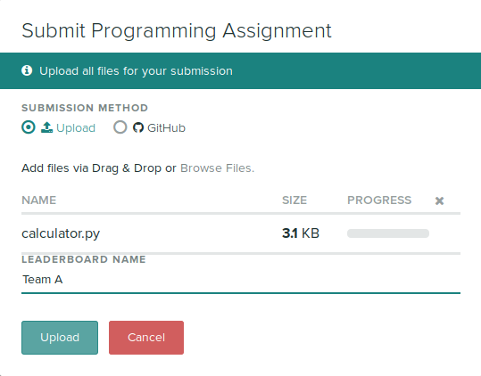
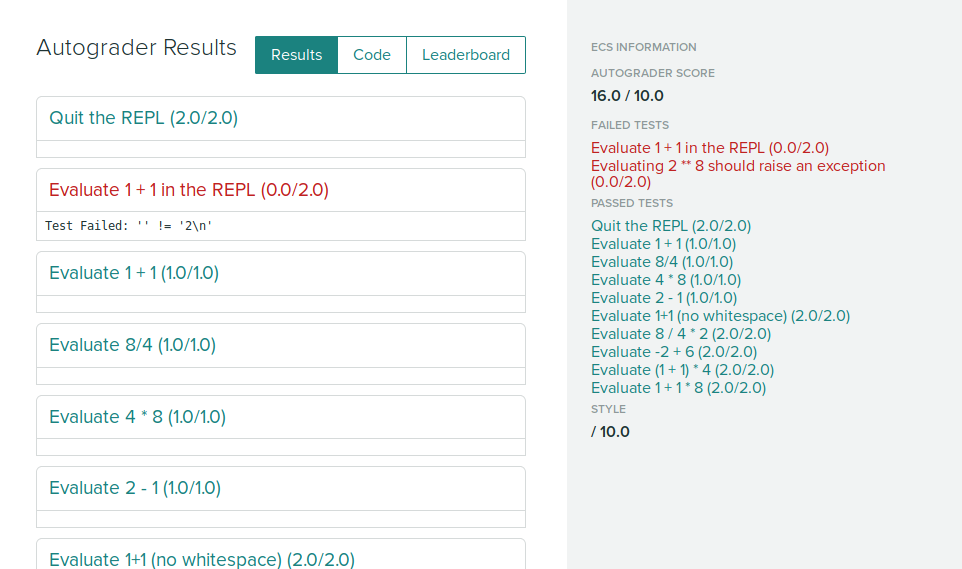

## Leaderboards

You can create leaderboards from quantities that are generated by your
autograder. You can use this for things like programming contests
where students compete to earn the highest score by some metric,
rather than being graded purely on correctness. Students will be
identified by pseudonyms that they choose, rather than by their actual
names. To enable leaderboard support for your assignment, enable the
setting at assignment creation or by changing the setting afterwards.

[](leaderboard_setting.png)


### Autograder specifications

For the leaderboard to work, your autograder must export a top-level
"leaderboard" section in the results.json output. This will be an
array, with objects defining the different quantities to be displayed
on the leaderboard.

```
{
  "leaderboard":
    [
      {"name": "Accuracy", "value": .926},
      {"name": "Time", "value": 15.1, "order": "asc"},
      {"name": "Stars", "value": "*****"}
    ]
}
```

You can specify the sort order for a quantity by specifying an "order"
property. The default is "desc" for descending, i.e. higher scores
rank higher, but for quantities like execution time you may want to
sort them in ascending order.

### Student submission

When students submit their work, they will be required to submit a
pseudonym for the leaderboard. This is to keep results anonymous.

[](submit_form_with_leaderboard.png)


After submitting, students will see a link to the leaderboard, if it
is enabled for the particular assignment.

[](submission_with_leaderboard_enabled.png)

Clicking on the leaderboard link will show a page with a sortable
table for the various leaderboard quantities defined in the
autograder. The student's submission will be highlighted in bold.

[](leaderboard.png)
