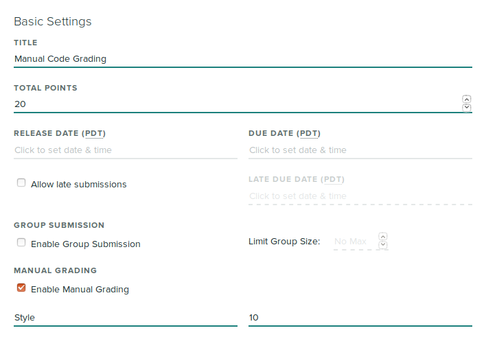
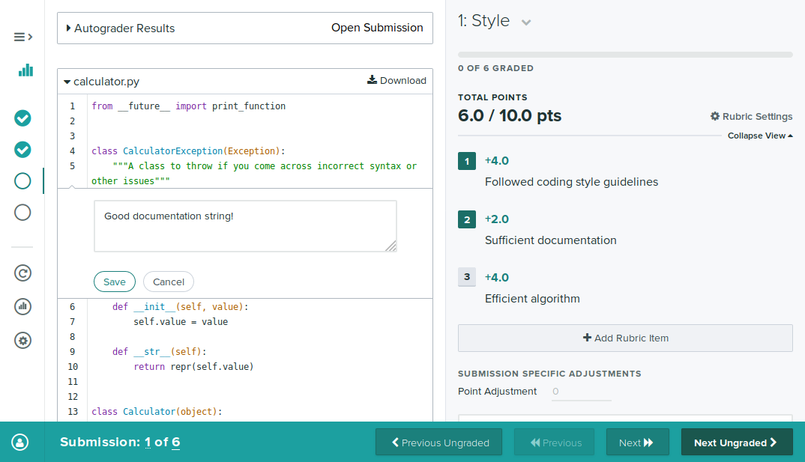
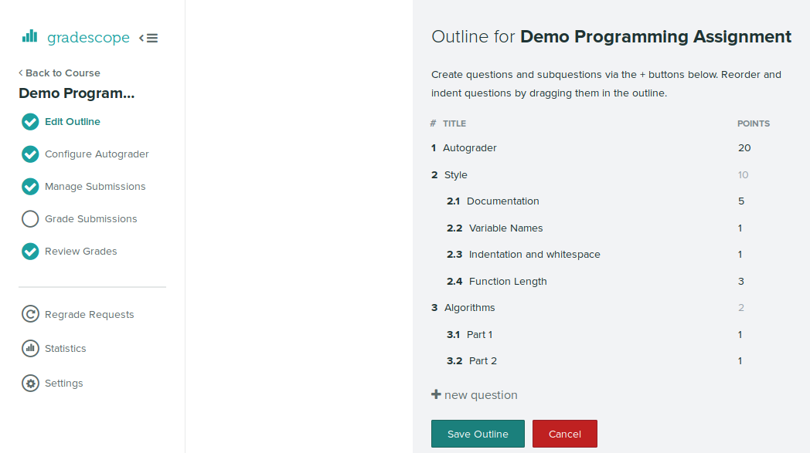

# Manual Grading

Gradescope also supports manual grading for programming assignments. You can
enable manual grading when creating your assignment, or afterwards by going to
the assignment's settings page.

When manual code grading is enabled, you will be able to grade students' code
manually using a rubric, as with other assignments on Gradescope. You can also
leave comments on lines of code.

If you would like to have more than one manually graded question, you can create
more questions via the "Edit Outline" step.

