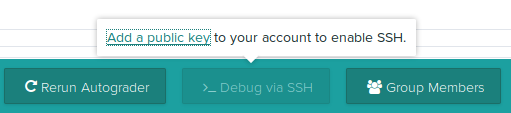
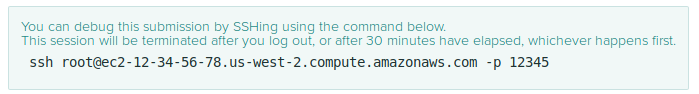

# Debugging via SSH

You can debug a submission by clicking the "Debug via SSH" button in
the action bar at the bottom of a submission. This will allow you to
log into a new, empty container that has your autograder code and the student's
code downloaded, set up in the same way as an actual autograder run.
You can then run the autograder to see the results that it would produce.

## Adding an SSH key

If you haven't done this before, you'll need to provide an SSH public
key. Click on the link in the popup to do so:

You'll be asked to paste your public key into a text field. It should
start with something like `ssh-rsa`, `ssh-dsa`, or something
similar. If you don't have one, see [GitHub's instructions](https://help.github.com/articles/generating-a-new-ssh-key-and-adding-it-to-the-ssh-agent/#generating-a-new-ssh-key)
for how to generate one. If copying from a terminal, make sure that
you don't include any line breaks, because there should not be any
line breaks in a public key.

### Account setttings

Once you have added one SSH key, you can add more keys or change
existing keys by going to the
[Account settings](https://gradescope.com/account/edit) page.

Your public keys will appear at the bottom of the page.

## Logging in via SSH

Once you've set up your public key, clicking on the button will start
a new container for you. As soon as it's ready, instructions will
appear that give you a command to run to log into the container.

After logging in, you can inspect the filesytem and run the
autograder. If the autograder fails to execute, you can make tweaks to
see how to fix the autograder or the submission.

## Persisting changes

Once you get the autograder running correctly, you can persist changes
by either resubmitting for the student, if the error is in the
student's code, or by uploading a new version of the autograder.
