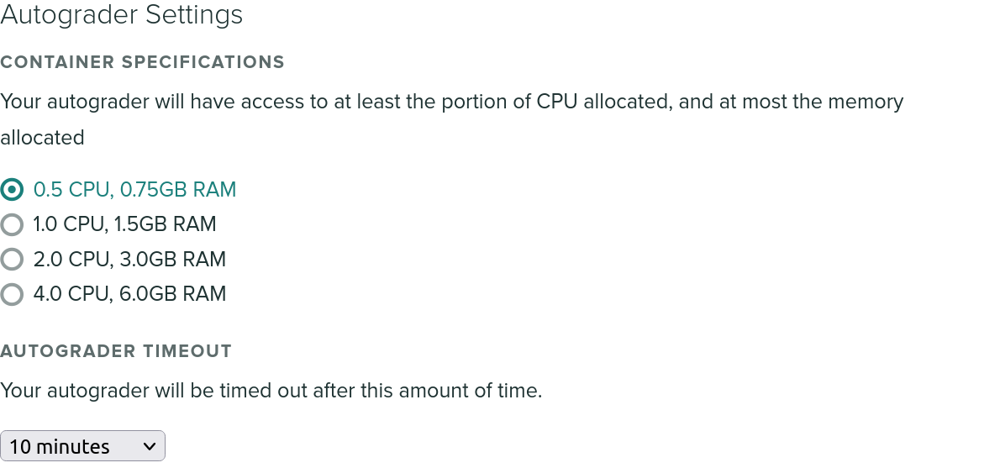

# Troubleshooting

## Common error messages

### Autograder terminated with 'Killed'

If you see the word 'Killed' at the end of your autograder run, and it gets
terminated abruptly, this likely means that your autograder was terminated due
to exceeding the default memory limit for a single container. Our default memory
limit is 384MB, but you can increase this from the "Advanced Settings" section
of the settings for your assignment.

### Your submission timed out

We have a default overall timeout of 10 minutes. If your autograder script takes
longer than that on our platform, it'll be forcibly terminated to avoid clogging
resources. To avoid running into our global timeout, we recommend adding
timeouts to your individual test cases - that'll at least allow your students to
receive a partial score for the parts that do terminate in a reasonable time
span. If they are subject to the global timeout, the submission will receive a 0
and, they won't see which tests were able to run successfully.

You can increase the timeout for your assignment on the assignment's settings
page, up to a maximum of 40 minutes. We don't recommend increasing it beyond
what you expect to need, because for submissions that don't terminate it will
just take that much longer to for the autograder to time out. Ideally, we would
recommend adding your own timeouts to individual test cases so that a mistake in
one test case does not cause a student to get a 0 overall.

Keep in mind that on our autograder cluster, multiple tasks are running
concurrently. By default, each autograder is allocated 1/4 of a virtual CPU, so
you should adjust your running time expectations accordingly. The easiest way to
do this is to simply time how long your solution code takes to run.

If you need a longer timeout, let us know and we may potentially increase the
global timeout for your assignment. You can also increase the CPU allocation if
it's a CPU-intensive assignment, under "Advanced Settings".

### The autograder failed to execute correctly

This error message is returned when the autograder does not produce a valid JSON
file in `/autograder/results/results.json`. This could either mean that no such
file exists, or that the JSON is malformed.

Make sure your JSON output is not being interleaved with print statements from
within your autograder code or student code. The safest way to write your JSON
is to build up the JSON object structure as your tests run, and then write it to
the file at once, rather than outputting partial JSON strings to standard output
and then redirecting standard output to `/autograder/results/results.json`. The
latter is helpful when debugging your script locally, but for production use
it's not ideal because any print statements will break the JSON structure.

## Contact us!

If you have any further questions, feel free to contact us
at [help@gradescope.com](mailto:help@gradescope.com). Please mention Autograder
in the subject line, it'll help us automatically categorize the type of support
request.
