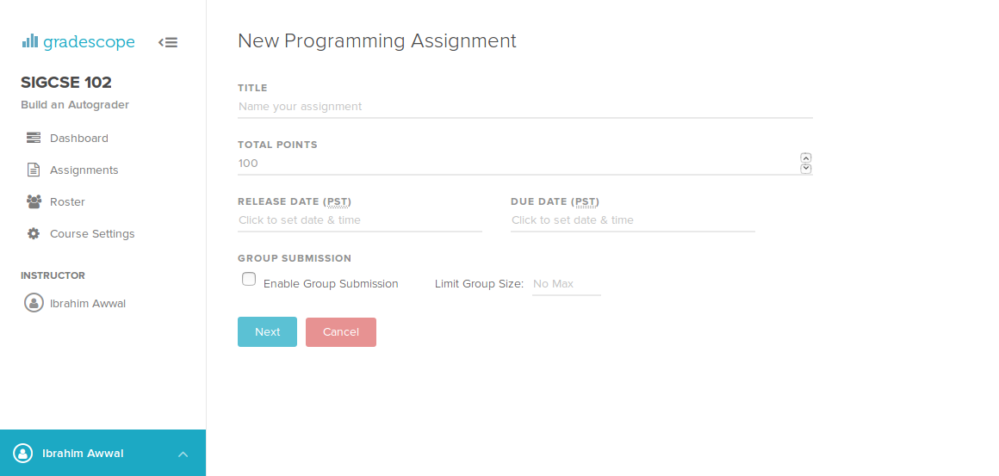

# Getting Started

## Pre-requisites

If you haven't made an account on Gradescope, sign up as an instructor at
[https://gradescope.com/](Gradescope.com).

Currently, programming assignments are in beta, so you'll need to request access to the feature by emailing [help@gradescope.com](mailto:help@gradescope.com).

You'll need to have a course set up, so create one if you don't have one.

## Setting Up Your Assignment

Navigate to the assignments tab on your course, and click on "Create Programming Assignment" in the bottom bar.

You'll be asked for some basic details about your assignment

